# AltiumDesigner9.4_tutorials  

   * [操作步骤详解](#操作步骤详解)
      * [新建PCB项目](#新建pcb项目)
      * [新建原理图文件](#新建原理图文件)
      * [绘制原理图文件](#绘制原理图文件)
         * [制作原理图库SchematicLibrary](#制作原理图库schematiclibrary)
      * [给元件添加封装](#给元件添加封装)
         * [制作封装库PCB Library](#制作封装库pcb-library)
         * [将封装应用到元件](#将封装应用到元件)
   * [PCB 设计基本概念](#pcb-设计基本概念)
   * [快捷操作](#快捷操作)
   * [通用规则](#通用规则)
   * [创建联合体Union](#创建联合体union)
   * [创建电路模块Snippet](#创建电路模块snippet)
   * [更改元件封装](#更改元件封装)
   * [批量更改元件封装](#批量更改元件封装)
   * [参考链接](#参考链接)

# 操作步骤详解
## 新建PCB项目
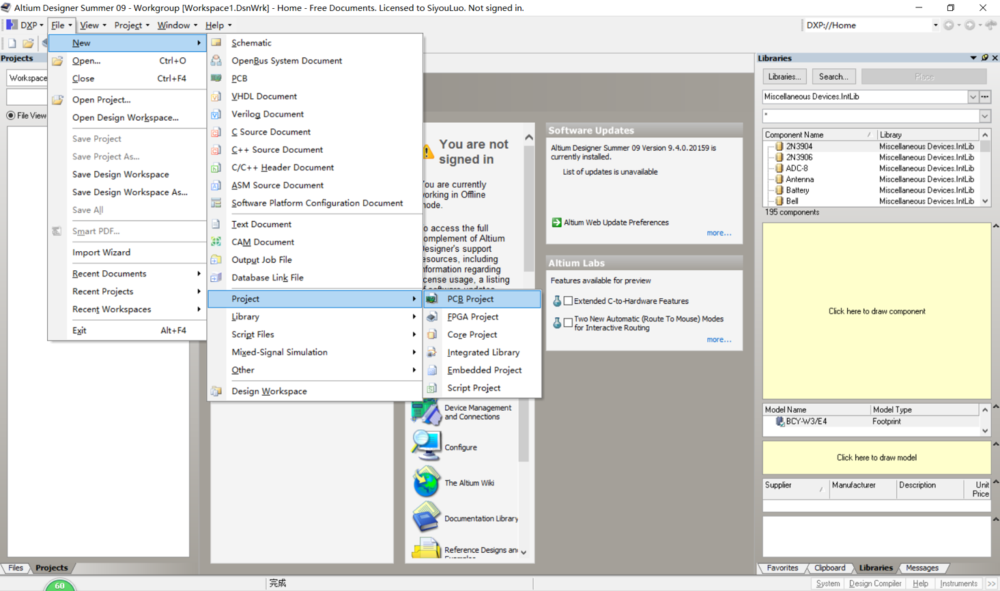  

右击\*.PrjPCB文件保存  

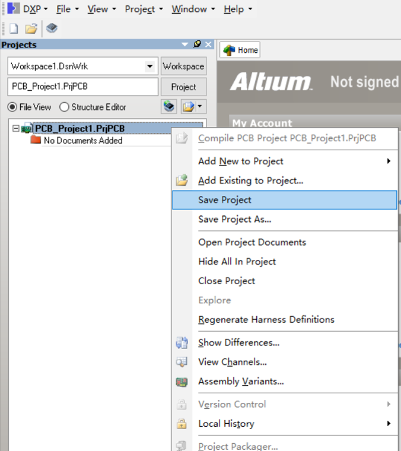  

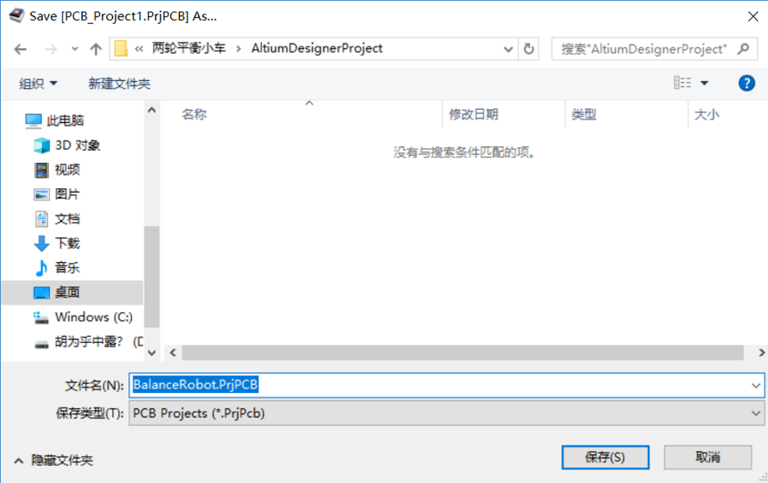  

## 新建原理图文件
右击\*.PrjPCB文件添加原理图  

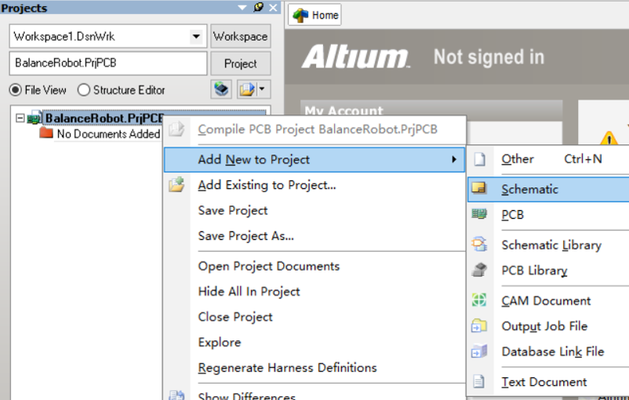  

右击\*.SchDoc文件保存  

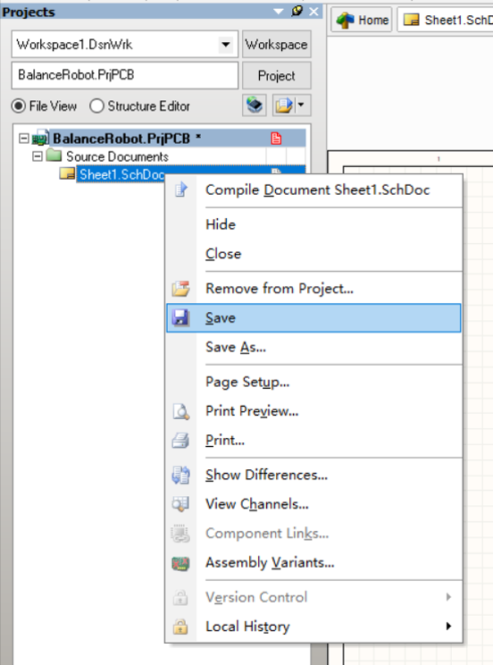  

## 绘制原理图文件
### 制作原理图库SchematicLibrary
我现在要添加一个stm32f103c8t6模块的原理图符号，但在AD的预装库中找不到该元件，因此我选择自己绘制一个（其实可以随便选一个有相同管脚数的元件代替，但需要仔细查看其管脚名称，后面需要和PCB元件符号相对应） 

----
右击\*.PrjPCB，添加一个原理图库Schematic Library  

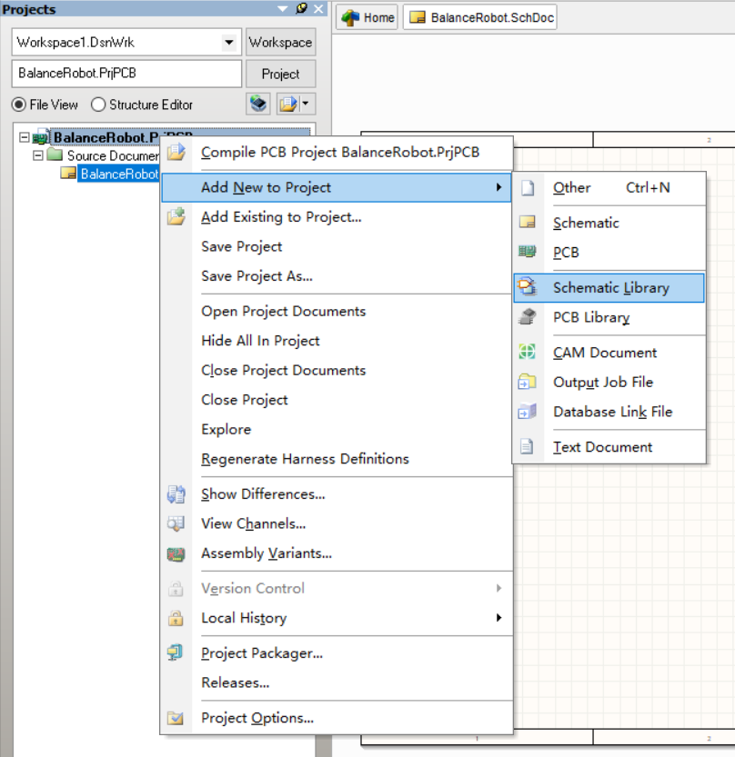  

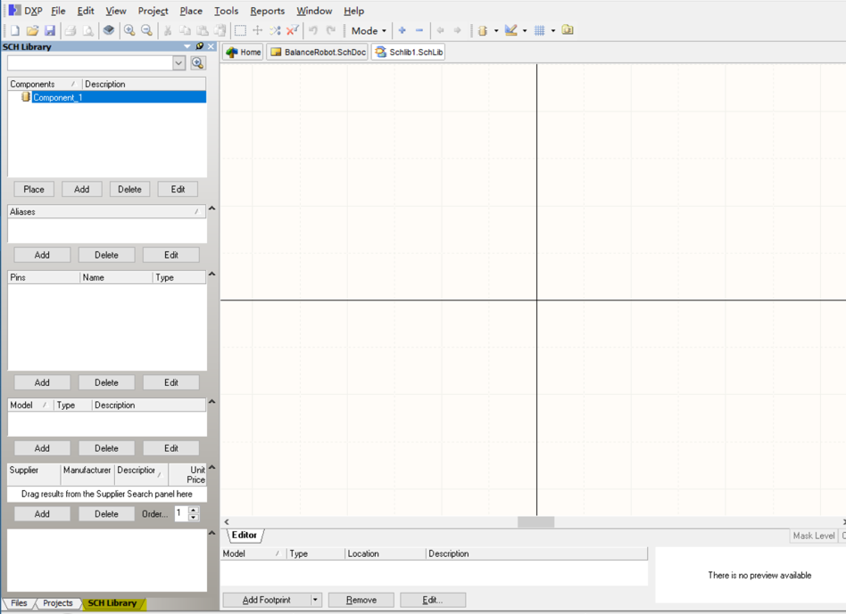  

如果SCH Library面板未显示出来，可在右下角点击SCH-> SCH Library打开  

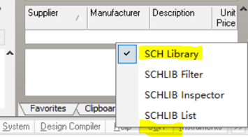  

点击Component_1下的Edit按钮，如图修改，点击OK  
其中Symbol Reference再改为stm32,DIP40，便于分辨    

  

添加管脚时designator为管脚号，需要和后面的元件封装对应，建议从左上角开始，逆时针序号依次递增（1,2,3……）  
绘制元件符号之后Ctrl+S保存  
如果还要添加其他的元件，点击左边栏的Add继续绘制即可  

  

要使用该元件时，右边栏libraries中下拉框第一个即为所新建的原理图库, 双击所需要的元件，放置在原理图合适位置  

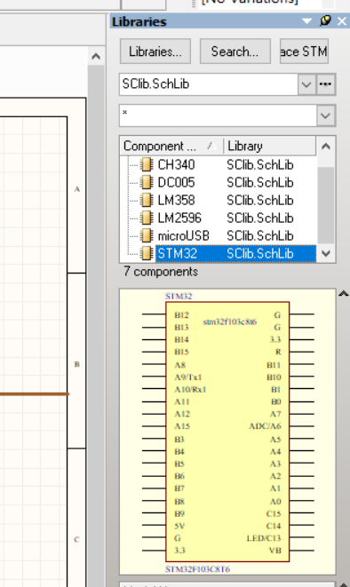  

## 给元件添加封装
### 制作封装库PCB Library
我现在需要给元件添加一个封装，同样AD预装的封装库不太好找，所以我需要自己建一个封装库  

----
在\*.PrjPCB上右键，添加PCB Library，保存，命名  

  

双击PCBCOMPONENT_1  

  

* 丝印层使用黄线Top Overlay
* 放置焊盘
* 因为实际制作出来的PCB板和封装中的尺寸一致，所以封装的制作需要足够精确    
* AD中一般使用英制单位
** 1mil=1/1000inch=0.0254mm
** 1mm=39.37mil
* 一般的DIP40封装格式为：
** 上下两个焊盘圆心间距100mil
** 两列焊盘圆心间距600mil
** 焊盘内孔35mil
** 外盘65mil
* 注意Designator标号与原理图符号匹配，从左上角开始逆时针递增（1,2,3……） 

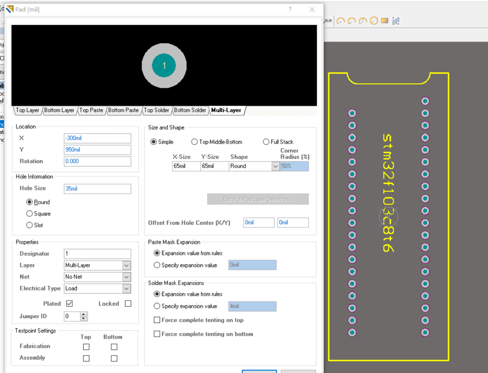  

在Components面板内右击，可添加新的元件并作相似修改  

  

### 将封装应用到元件
在原理图中双击元件，点击Add，选择Footprint，OK  

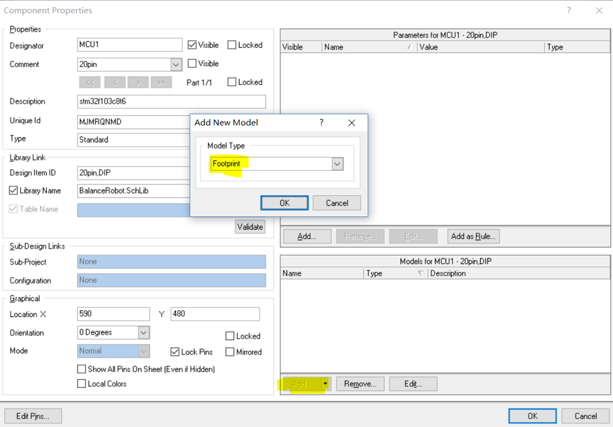  

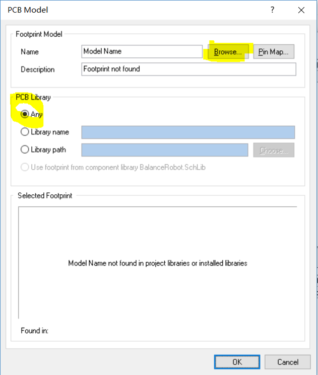  

  

# PCB 设计基本概念

1. “层(Layer) ”的概念 与字处理或其它许多软件中为实现图、文、色彩等的嵌套与合成而
引入的“层”的概念有所同，Protel 的“层”不是虚拟的，而是印刷板材料本身实实在在的各铜
箔层。现今，由于电子线路的元件密集安装。防干扰和布线等特殊要求，一些较新的电子产
品中所用的印刷板不仅有上下两面供走线，在板的中间还设有能被特殊加工的夹层铜箔，例
如，现在的计算机主板所用的印板材料多在 4 层以上。这些层因加工相对较难而大多用于设
置走线较为简单的电源布线层（如软件中的 Ground Dever 和 Power Dever），并常用大面积
填充的办法来布线（如软件中的 ExternaI P1a11e 和 Fill）。上下位置的表面层与中间各层需
要连通的地方用软件中提到的所谓“过孔（Via）”来沟通。有了以上解释，就不难理解“多层
焊盘”和“布线层设置”的有关概念了。举个简单的例子，不少人布线完成，到打印出来时方
才发现很多连线的终端都没有焊盘，其实这是自己添加器件库时忽略了“层”的概念，没把自
己绘制封装的焊盘特性定义为”多层（Mulii 一 Layer)的缘故。要提醒的是，一旦选定了所用
印板的层数，务必关闭那些未被使用的层，免得惹事生非走弯路。

2. 过孔(Via） 为连通各层之间的线路，在各层需要连通的导线的文汇处钻上一个公共孔，
这就是过孔。工艺上在过孔的孔壁圆柱面上用化学沉积的方法镀上一层金属，用以连通中间
各层需要连通的铜箔，而过孔的上下两面做成普通的焊盘形状，可直接与上下两面的线路相
通，也可不连。一般而言，设计线路时对过孔的处理有以下原则：
	1. 尽量少用过孔，一旦选用了过孔，务必处理好它与周边各实体的间隙，特别是容易被
	忽视的中间各层与过孔不相连的线与过孔的间隙，如果是自动布线，可在“过孔数量最小化”
    （ Via Minimiz8tion）子菜单里选择“on”项来自动解决。
	2. 需要的载流量越大，所需的过孔尺寸越大，如电源层和地层与其它层联接所用的过孔
    就要大一些。
    
3. 丝印层（Overlay） 为方便电路的安装和维修等，在印刷板的上下两表面印刷上所
需要的标志图案和文字代号等，例如元件标号和标称值、元件外廓形状和厂家标志、生产日
期等等。不少初学者设计丝印层的有关内容时，只注意文字符号放置得整齐美观，忽略了实
际制出的 PCB 效果。他们设计的印板上，字符不是被元件挡住就是侵入了助焊区域被抹赊，
还有的把元件标号打在相邻元件上，如此种种的设计都将会给装配和维修带来很大不便。正
确的丝印层字符布置原则是：”不出歧义，见缝插针，美观大方”。
    
4. SMD 的特殊性 Protel 封装库内有大量 SMD 封装，即表面焊装器件。这类器件除体
积小巧之外的最大特点是单面分布元引脚孔。因此，选用这类器件要定义好器件所在面，以
免“丢失引脚（Missing Plns）”。另外，这类元件的有关文字标注只能随元件所在面放置。
    
5. 网格状填充区（External Plane ）和填充区(Fill) 正如两者的名字那样，网络状填充
区是把大面积的铜箔处理成网状的，填充区仅是完整保留铜箔。初学者设计过程中在计算机
上往往看不到二者的区别，实质上，只要你把图面放大后就一目了然了。正是由于平常不容
易看出二者的区别，所以使用时更不注意对二者的区分，要强调的是，前者在电路特性上有
较强的抑制高频干扰的作用，适用于需做大面积填充的地方，特别是把某些区域当做屏蔽区、
分割区或大电流的电源线时尤为合适。后者多用于一般的线端部或转折区等需要小面积填充
的地方。

6. 焊盘( Pad） 焊盘是 PCB 设计中最常接触也是最重要的概念，但初学者却容易忽视
它的选择和修正，在设计中千篇一律地使用圆形焊盘。选择元件的焊盘类型要综合考虑该元
件的形状、大小、布置形式、振动和受热情况、受力方向等因素。Protel 在封装库中给出了
一系列不同大小和形状的焊盘，如圆、方、八角、圆方和定位用焊盘等，但有时这还不够用，
需要自己编辑。例如，对发热且受力较大、电流较大的焊盘，可自行设计成“泪滴状”，在大
家熟悉的彩电 PCB 的行输出变压器引脚焊盘的设计中，不少厂家正是采用的这种形式。一
般而言，自行编辑焊盘时除了以上所讲的以外，还要考虑以下原则：
	1. 形状上长短不一致时要考虑连线宽度与焊盘特定边长的大小差异不能过大；
	2. 需要在元件引角之间走线时选用长短不对称的焊盘往往事半功倍；
	3. 各元件焊盘孔的大小要按元件引脚粗细分别编辑确定，原则是孔的尺寸比引脚直径大0.2-0.4 毫米。
    
7. 各类膜（Mask) 这些膜不仅是 PcB 制作工艺过程中必不可少的，而且更是元件焊
装的必要条件。按“膜”所处的位置及其作用，“膜”可分为元件面（或焊接面）助焊膜（TOp
or Bottom 和元件面（或焊接面）阻焊膜（TOp or BottomPaste Mask）两类。 顾名思义，助
焊膜是涂于焊盘上，提高可焊性能的一层膜，也就是在绿色板子上比焊盘略大的各浅色圆斑。
阻焊膜的情况正好相反，为了使制成的板子适应波峰焊等焊接形式，要求板子上非焊盘处的
铜箔不能粘锡，因此在焊盘以外的各部位都要涂覆一层涂料，用于阻止这些部位上锡。可见，
这两种膜是一种互补关系。由此讨论，就不难确定菜单中类似“solder Mask En1argement”等
项目的设置了。

8. 飞线，飞线有两重含义：
	1. 自动布线时供观察用的类似橡皮筋的网络连线，在通过网络表调入元件并做了初步布
    局后，用“Show 命令就可以看到该布局下的网络连线的交叉状况，不断调整元件的位置使
    这种交叉最少，以获得最大的自动布线的布通率。这一步很重要，可以说是磨刀不误砍柴功，
    多花些时间，值！另外，自动布线结束，还有哪些网络尚未布通，也可通过该功能来查找。
    找出未布通网络之后，可用手工补偿，实在补偿不了就要用到“飞线”的第二层含义.
    2. 在将来的印板上用导线连通这些网络。要交待的是，如果该电路板是大批量自动线生产，可将
    这种飞线视为 0 欧阻值、具有统一焊盘间距的电阻元件来进行设计.

# 快捷操作  
|作用|操作|
|----|----|
|drag（拖动元件时不断开连线）|Ctrl+鼠标左键单击|
|move（拖动元件时断开连线）|鼠标左键单击|
|缩放|Ctrl+滚轮|
|上下移动|滚轮|
|左右移动|Shift+滚轮|
|拖拽原理图|按住鼠标右键，拖动鼠标|
|元件自动编号|Tools -> Annotate Schematics|
|PCB仅显示当前层连线（再按一次恢复）|Shift+S|
|补泪滴|T+E,默认设置，单击OK|
|从已有的原理图生成原理图库（.SCHLIB文件）|Design -> Make Schematic Library ->保存|
|生成网表|Design -> Netlist For Project ->protel|
|生成元件清单|Report-> Bill of Materials->Template选择合适模板->export（导出）|
|删除所有net|Unknown Pin：design->netlist->edit net->删除所有net|
|删除所有PCB布线|T+U+A|
|PCB设置坐标原点|E+O+S|
|PCB连导线|P+T|

# 通用规则
|元件引脚直径(D)|PCB焊盘孔径(内径)|
|---|---|
|D<=40mil|D+12mil|
|40mil<D<80mil|D+16mil|
|D>80mil|D+20mil|

外径 = 内径 + 0.8mm  
Thermal relief = 外径  
Anti pad = 外径 + 0.1mm  

[电源线和地线的布线规则](https://www.element14.com/community/thread/9605/l/电源线和地线的布线规则?displayFullThread=true)  
尽量加宽电源线、地线宽度，最好是地线比电源线宽。它们的关系是：地线＞电源线＞信号线，通常信号线宽为：0.2～0.3mm,最细宽度可达0.05～0.07mm,电源线为1.2～2.5 mm.  
[Altium Designer PCB中各层作用详解](http://wentao1213.com/2017/03/12/ad-layer-introduction/)  

# 创建联合体Union  
选中一小块独立的电路，鼠标右键  

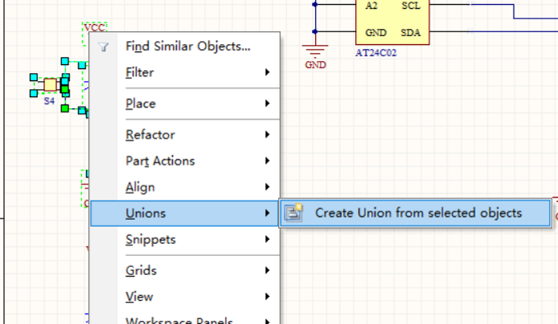  

之后整块电路可以作为一个整体进行拖动  
但如果你先选中了联合体中的某一个元件，再进行拖动，则为单独拖动该元件  

----
逆向操作：break  

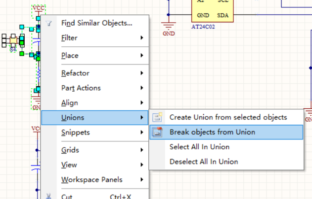  

# 创建电路模块Snippet
选中一小块独立的电路，鼠标右键  

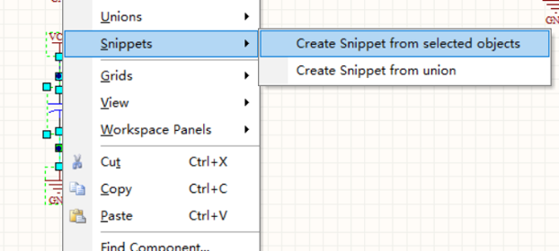  

重命名并选择存放地址，添加注释，点击OK  

  

调用Snippet：点击System-> Snippets  

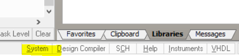  

双击所需要的Snippets放置到电路中  

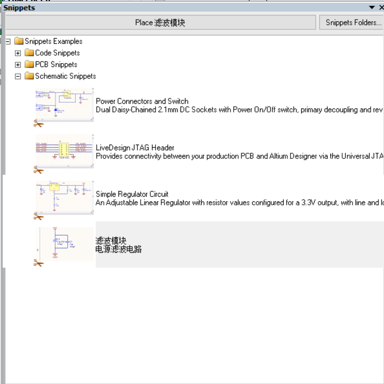  

# 更改元件封装
点击Tools ->Footprint Manager……  

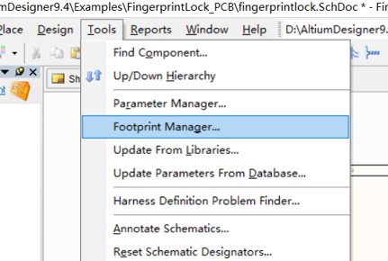  

在左边选中某个元件后，在右边列出的可用封装中选中某一个  

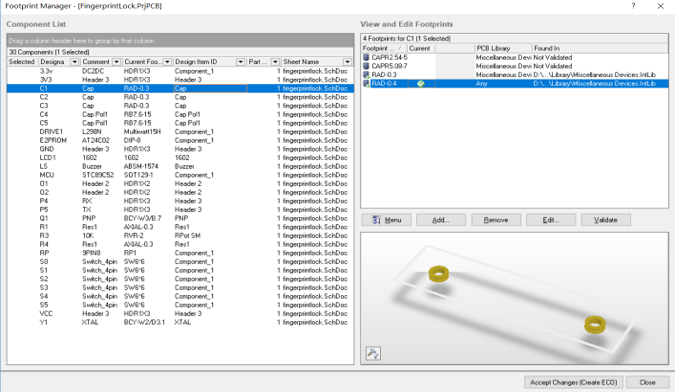  

鼠标右击，选择set as current  

  

面板右下角点击Accept Changes  

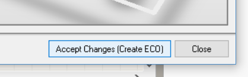  

然后依次点击Validate Changes和Execute Changes  

  

# 批量更改元件封装
选中一个电容，鼠标右击，点击第一个Find Similar Objects……  

  

弹出对话框，修改右边一列以更改查找条件，例如需要查找所有RAD-0.3封装的电容，如图修改两处，点击OK  

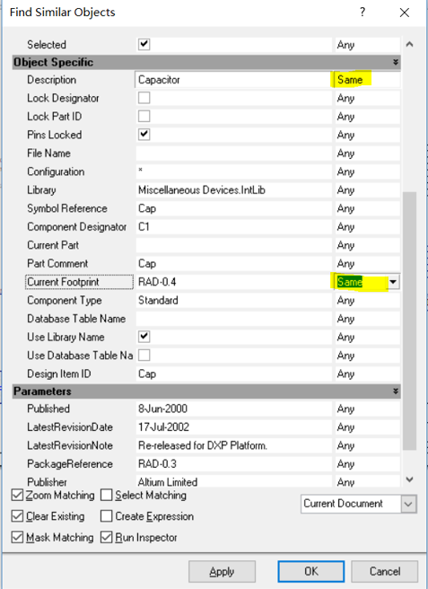  

图中高亮显示匹配上的元件，按住shift键，单击选中需要修改的元件（或者Ctrl+A选中所有）  

  

以上是用查找的方式选中所有元件，如果你对原理图足够熟悉，也可按住shift键，一个一个单击元件选中所有电容   

----
如图打开SCH Inspector面板  

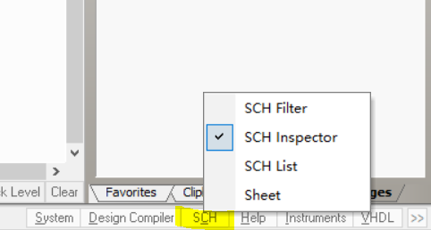  

  

如图修改Current Footprint参数为RAD-0.4，回车  

  

点clear，清除原理图中的蒙版  

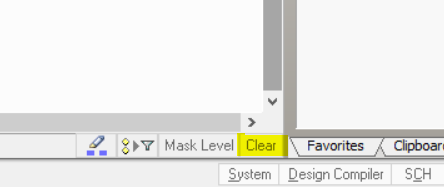  

此时，原理图中所有选中的电容封装都已更改为RAD-0.4，同理也可修改元件的容值等其他参数  

# 参考链接
[在线长度转换](https://convertlive.com/zh/u/转换/毫米/自/密耳#1)  
[altium designer 标题栏设置方法 - 百度文库](https://wenku.baidu.com/view/f2d4b7b569dc5022aaea0036.html)  
[电源线和地线的布线规则](https://www.element14.com/community/thread/9605/l/电源线和地线的布线规则?displayFullThread=true)  
[Altium Designer PCB中各层作用详解](http://wentao1213.com/2017/03/12/ad-layer-introduction/)  
