# AltiumDesigner9.4_tutorials  
# Tips  
|操作|作用|
|----|----|
|Ctrl+鼠标左键单击|drag（拖动元件时不断开连线）|
|鼠标左键单击|move（拖动元件时断开连线）|
|Ctrl+滚轮|缩放|
|滚轮|上下移动|
|Shift+滚轮|左右移动|
|按住鼠标右键，拖动鼠标|拖拽原理图|
|Tools -> Annotate Schematics|元件自动编号|
|Shift+S|仅显示当前层连线（再按一次恢复）|
|T+E,默认设置，单击OK|补泪滴|
|Design -> Make Schematic Library ->保存|从已有的原理图生成原理图库（.SCHLIB文件）|
|Design -> Netlist For Project ->protel|生成网表|
|Report-> Bill of Materials->Template选择合适模板->export（导出）|生成元件清单|
|Unknown Pin：design->netlist->edit net->删除所有net|
|画PCBDOC，快捷键EOS设置坐标原点，PT连导线|
# 创建联合体Union  

    选中一小块独立的电路，鼠标右键

    之后整块电路可以作为一个整体进行拖动
    但如果你先选中了联合体中的某一个元件，再进行拖动，则为单独拖动该元件  
----

    逆向操作：break
  
# 创建电路模块Snippet

    选中一小块独立的电路，鼠标右键

    重命名并选择存放地址，添加注释，点击OK
  

    调用Snippet：点击System-> Snippets

    双击所需要的Snippets放置到电路中
  
# 更改元件封装  

    点击Tools ->Footprint Manager……

    在左边选中某个元件后，在右边列出的可用封装中选中某一个

    鼠标右击，选择set as current

    面板右下角点击Accept Changes

    然后依次点击Validate Changes和Execute Changes

# 批量更改元件封装（以电容为例）  

    选中一个电容，鼠标右击，点击第一个Find Similar Objects……

    弹出对话框，修改右边一列以更改查找条件，例如需要查找所有RAD-0.3封装的电容，如图修改两处，点击OK

    图中高亮显示匹配上的元件，按住shift键，单击选中需要修改的元件（或者Ctrl+A选中所有）
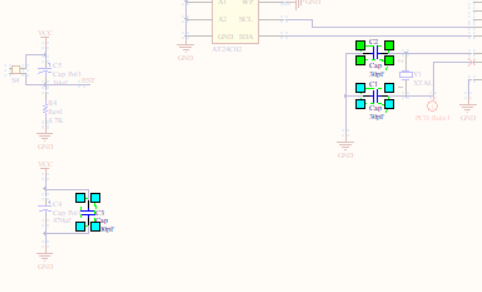

    以上是用查找的方式选中所有元件，如果你对原理图足够熟悉，也可按住shift键，一个一个单击元件选中所有电容  
----

    如图打开SCH Inspector面板

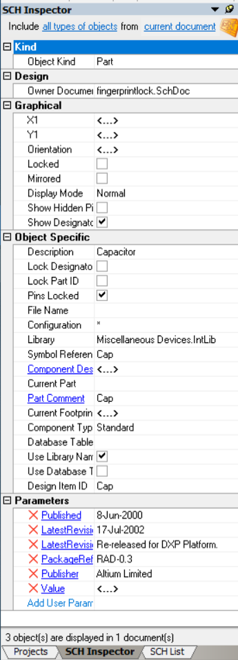

    如图修改Current Footprint参数为RAD-0.4，回车
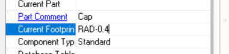

    点clear，清除原理图中的蒙版

    此时，原理图中所有选中的电容封装都已更改为RAD-0.4，同理也可修改元件的容值等其他参数  
# 操作步骤详解
## 新建PCB项目
  

    右击*.PrjPCB文件保存
 
 
## 新建原理图文件

    右击*.PrjPCB文件添加原理图
 

    右击*.SchDoc文件保存
  
## 绘制原理图文件
### 制作原理图库Schematic Library

    我现在要添加一个stm32f103c8t6模块的原理图符号，但在AD的预装库中找不到该元件，因此我选择自己绘制一个（其实可以随便选一个有相同管脚数的元件代替，但需要仔细查看其管脚名称，后面需要和PCB元件符号相对应）
----

    右击*.PrjPCB，添加一个原理图库Schematic Library
  
  

    如果SCH Library面板未显示出来，可在右下角点击SCH-> SCH Library打开
  

    点击Component_1下的Edit按钮，如图修改，点击OK
    其中Symbol Reference再改为stm32,DIP40，便于分辨  
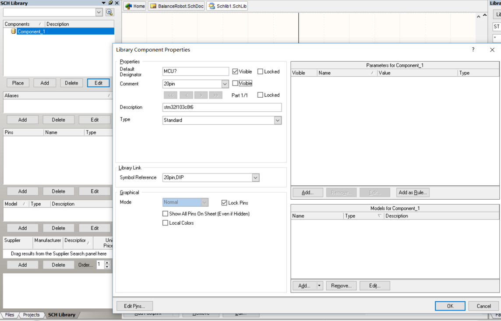  

    添加管脚时designator为管脚号，需要和后面的元件封装对应，建议从左上角开始，逆时针序号依次递增（1,2,3……）
    绘制元件符号之后Ctrl+S保存
    如果还要添加其他的元件，点击左边栏的Add继续绘制即可
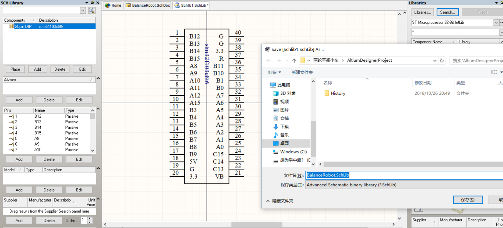  

    要使用该元件时，点击libraries->install,找到原理图库保存的地址，打开，close。双击所需要的元件，放置在原理图合适位置
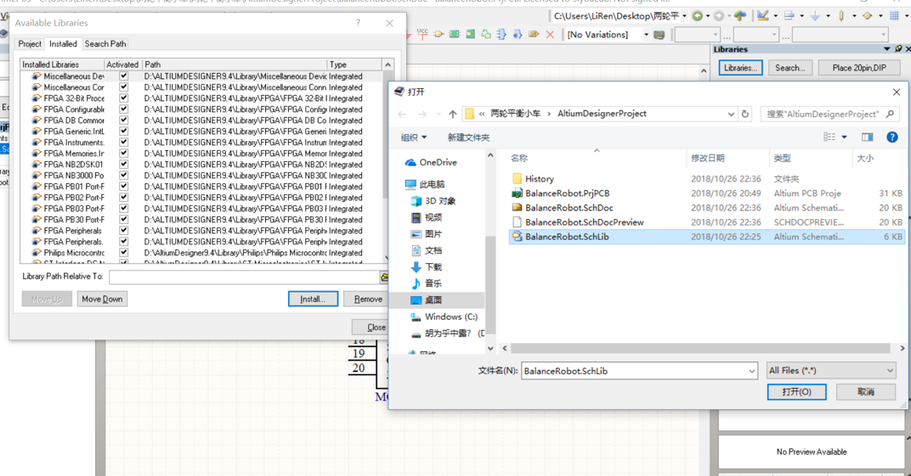  

    右边打开下拉框，找到刚才新建的元件库，双击component，在原理图中放置元件，重命名
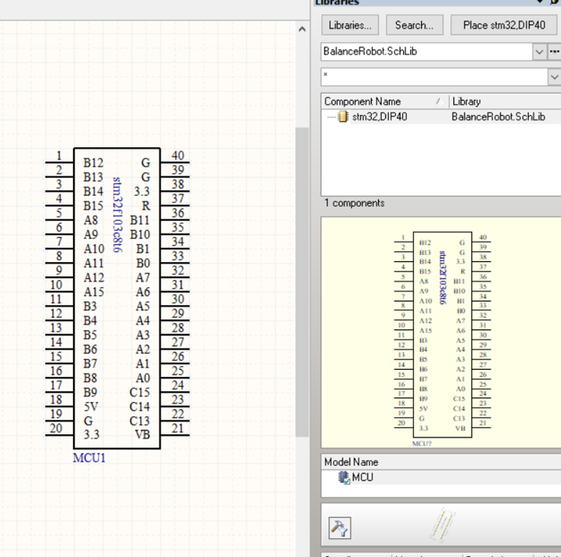  
## 给元件添加封装
### 制作封装库PCB Library

    我现在需要给元件添加一个封装，同样AD预装的封装库不太好找，所以我需要自己建一个封装库
----

    在*.PrjPCB上右键，添加PCB Library，保存，命名
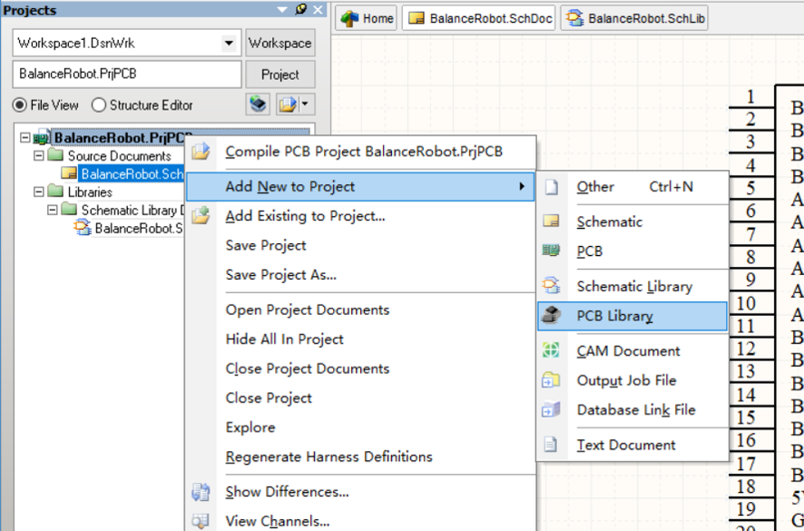  

    双击PCBCOMPONENT_1
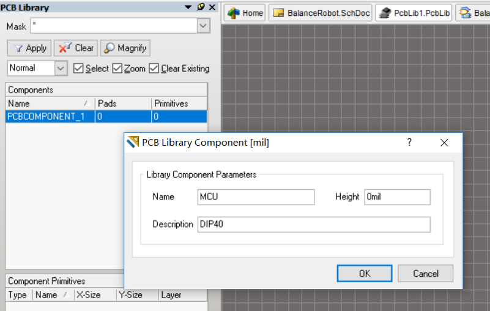  

    >丝印层使用黄线Top Overlay
    >放置焊盘
    >因为实际制作出来的PCB板和封装中的尺寸一致，所以封装的制作需要足够精确
    
    >AD中一般使用英制单位
    >>1mil=1/1000inch=0.0254mm
    >>1mm=39.37mil
    
    >一般的DIP40封装格式为：
    >>上下两个焊盘圆心间距100mil
    >>两列焊盘圆心间距600mil
    >>焊盘内孔35mil
    >>外盘65mil

    >注意Designator标号与原理图符号匹配，从左上角开始逆时针递增（1,2,3……）
  

    在Components面板内右击，可添加新的元件并作相似修改
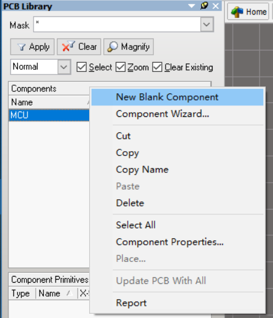  

### 将封装应用到元件
    在原理图中双击元件，点击Add，选择Footprint，OK，
  
  
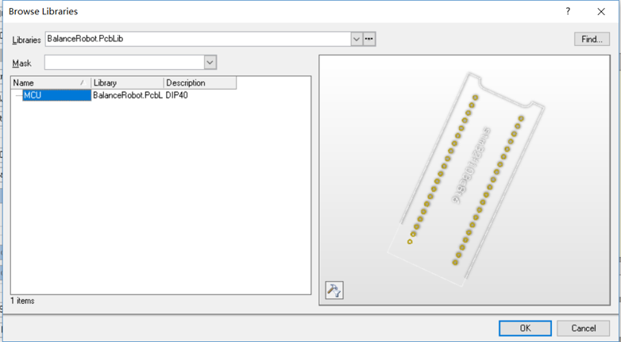  
