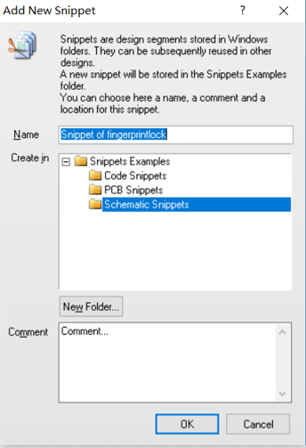
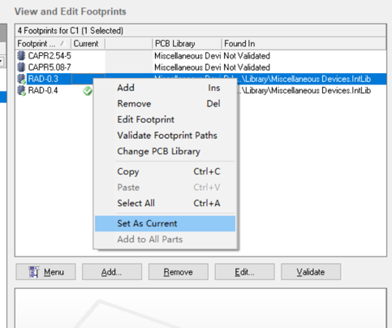
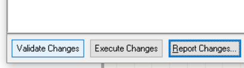

# AltiumDesigner9.4_tutorials  
# Tips  
|操作|作用|
|----|----|
|Ctrl+鼠标左键单击|drag（拖动元件时不断开连线）|
|鼠标左键单击|move（拖动元件时断开连线）|
|Ctrl+滚轮|缩放|
|滚轮|上下移动|
|Shift+滚轮|左右移动|
|按住鼠标右键，拖动鼠标|拖拽原理图|
|Tools -> Annotate Schematics|元件自动编号|
|Shift+S|仅显示当前层连线（再按一次恢复）|
|T+E,默认设置，单击OK|补泪滴|
|Design -> Make Schematic Library ->保存|从已有的原理图生成原理图库（.SCHLIB文件）|
|Design -> Netlist For Project ->protel|生成网表|
|Report-> Bill of Materials->Template选择合适模板->export（导出）|生成元件清单|
|Unknown Pin：design->netlist->edit net->删除所有net|
|画PCBDOC，快捷键EOS设置坐标原点，PT连导线|
# 创建联合体Union  
选中一小块独立的电路，鼠标右键  之后整块电路可以作为一个整体进行拖动 但如果你先选中了联合体中的某一个元件，再进行拖动，则为单独拖动该元件  
逆向操作：break   
# 创建电路模块Snippet
选中一小块独立的电路，鼠标右键  重命名并选择存放地址，添加注释，点击OK   
调用Snippet：点击System-> Snippets  双击所需要的Snippets放置到电路中   
# 更改元件封装  
点击Tools ->Footprint Manager……  在左边选中某个元件后，在右边列出的可用封装中选中某一个  鼠标右击，选择set as current  面板右下角点击Accept Changes 然后依次点击Validate Changes和Execute Changes 

