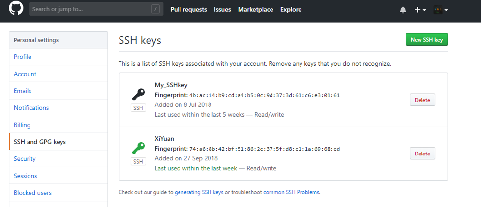

# git/github
---
   * [Git/Github](#gitgithub)
      * [安装](#安装)
      * [设置](#设置)
      * [基本命令](#基本命令)
      * [将本地库关联到远程](#将本地库关联到远程)
      * [MarkDown](#MarkDown)
      * [TOC](#toc)

# Git/Github  
整理自[Git教程 - 廖雪峰的官方网站](https://www.liaoxuefeng.com/wiki/0013739516305929606dd18361248578c67b8067c8c017b000)  
## 安装
Debian系列安装git  

    $ sudo apt-get install git  

Windows安装参考[Git - Downloads](https://git-scm.com/downloads)  
## 设置  

    $ git config --global user.name "Your Name"  
    $ git config --global user.email "email@example.com"  

注意git config命令的--global参数，用了这个参数，表示你这台机器上所有的Git仓库都会使用这个配置。当然也可以对某个仓库指定不同的用户名和Email地址。  
## 基本命令  

    $ mkdir learngit  
    $ cd learngit  
    $ pwd  
    /Users/michael/learngit  

    $ git init  
    Initialized empty Git repository in /Users/michael/learngit/.git/  

通过git init命令把这个目录变成Git可以管理的仓库  

|命令|作用|
|----|----|
|$ git add readme.txt|将文件添加到git仓库暂存区|
|$ git commit -m "wrote a readme file" |将文件提交到git仓库|
|git reset --hard HEAD^|回退到上一个版本|
|git reset --hard 1094a|回退到commit id的前几位为1094a的版本<br>commit id可以使用git log查看|
|$ git status |查看git仓库当前状态，并提示下一步操作|
|$ git diff readme.txt |查看本地文件和git仓库的区别|
|$ git log |查看提交记录|
|$ git log --pretty=oneline |查看提交记录|
|$ git branch dev|创建新的分支dev|
|$ git checkout dev|切换到dev分支|
|$ git checkout -b dev |创建新的分支dev，并切换到该分支|
|$ git branch -d dev |merge之后删除分支dev|
|$ git branch -D dev |放弃修改直接删除分支dev|

## 将本地库关联到远程  
<table>
<tr>
    <td width="200">ssh-keygen -t rsa –C example@example.com<br>
        #密码可设置为空</td>
    <td rowspan="7"></td>
</tr>
<tr>
    <td>将本地生成的id_rsa.pub添加到SSH key</td>
</tr>

<tr>
    <td>在GitHub建立新的仓库，按提示操作</td>
</tr>

<tr>
    <td>git remote add origin git@github.com:LiRengithub/Sort.git</td>
</tr>

<tr>
    <td>git push -u origin master<br>
    #若将其他分支例如dev推送到远程则:git push origin dev</td>
</tr>

<tr>
    <td>git checkout [-b] MergeSort<br>
    git pull origin MergeSort<br>
    #将远程分支MergeSort拉取到本地MergeSort</td>
</tr>
</table>

    push.default的默认值在 Git 2.0 已从 'matching'变更为 'simple'
    # 配置push.default的值
    $ git config --global push.default matching   #git 将推送和远程同名的所有本地分支
    # 或
    $ git config --global push.default simple #只推送当前分支到远程关联的同名分支，即 'git push' 推送当前分支。
    # 从 Git 2.0 开始，Git 默认采用更为保守的 'simple' 模式，
    # 参见 'git help config' 并查找 'push.default' 以获取更多信息。
    #（'simple' 模式由 Git 1.7.11 版本引入。如果您有时要使用老版本的 Git，为保持兼容，请用 'current' 代替 'simple'）  

## MarkDown
[编写\*.md文件](https://github.com/guodongxiaren/README)  
[在markdown中使用HTML中的特殊符号](https://blog.csdn.net/vola9527/article/details/69948411)  
## TOC  
为markdown文档自动添加目录  
[github链接](https://github.com/ekalinin/github-markdown-toc)  

```bash
    $ wget https://raw.githubusercontent.com/ekalinin/github-markdown-toc/master/gh-md-toc
    $ chmod a+x gh-md-toc  
    $ cat README.md | ./gh-md-toc -
```
